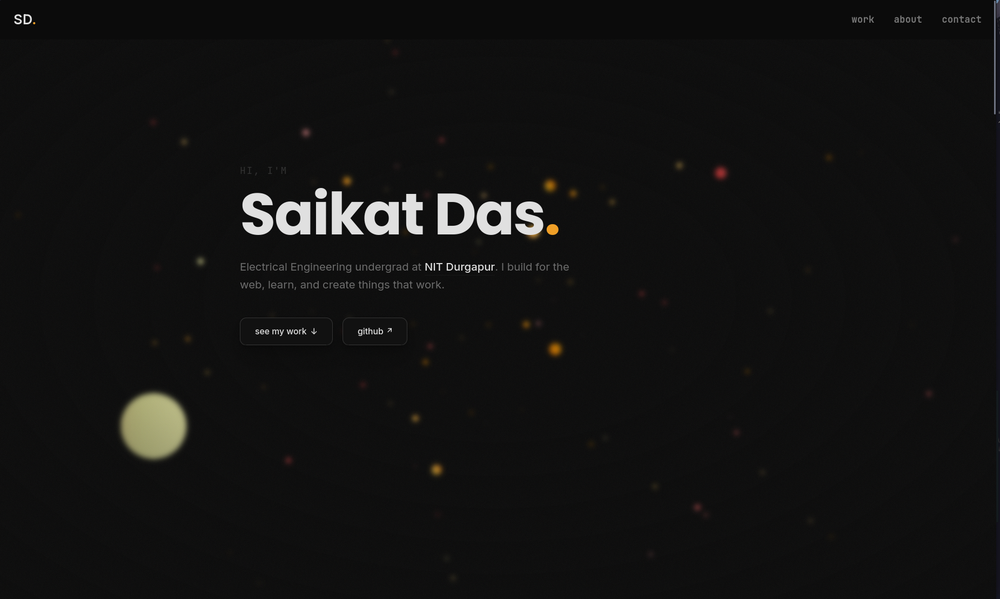

# Personal Portfolio


[](https://portfolio-hac152a0h-saikat-codes-projects.vercel.app)


Personal portfolio site built with Next.js 16, Tailwind CSS v4, and Framer Motion. Features live GitHub stats, a WebGL particle background, and scroll-driven animations.

> **Admin panel + backend coming soon** — project management via Vercel KV planned.

---

## ✨ Features

- **WebGL particle background** — amber particle field via OGL, blurred + grain overlay
- **Decrypted text animation** — hero name scrambles in on load and re-triggers on hover
- **Live GitHub data** — contributions, longest streak, and contribution calendar pulled from public APIs
- **Scroll animations** — every section fades up via a reusable `FadeUp` component (Framer Motion)
- **Custom fonts** — Poppins (headings), Inter (body), JetBrains Mono (code/tags)
- **Responsive** — mobile-first, tested across breakpoints
- **Vercel deployed** — auto-deploys on every push to `main`

---

## 🛠️ Tech Stack

| Layer | Tech |
|-------|------|
| Framework | Next.js 16 (App Router) |
| Styling | Tailwind CSS v4 |
| Animation | Framer Motion + Motion |
| 3D / WebGL | OGL |
| Icons | Devicons CDN + inline SVG |
| Fonts | Google Fonts via `next/font` |
| Deployment | Vercel |

---

## 📁 Folder Structure

```
portfolio/
├── app/
│   ├── layout.jsx          # Root layout — fonts, particles bg, navbar
│   ├── page.jsx            # Home page — all sections assembled
│   └── globals.css         # Base styles, Tailwind theme tokens, grain
│
├── components/
│   ├── Navbar.jsx
│   ├── Hero.jsx
│   ├── Projects.jsx
│   ├── Journey.jsx
│   ├── Skills.jsx
│   ├── Github.jsx
│   ├── About.jsx
│   ├── Footer.jsx
│   ├── ContributionGraph.jsx
│   ├── DecryptedText.jsx
│   ├── FadeUp.jsx
│   └── Particles.jsx
│
├── public/
├── tailwind.config.js      # (not used in v4 — config lives in globals.css)
├── next.config.js
└── package.json
```

---

## 🚀 Running Locally

**Prerequisites:** Node.js 18+, npm

```bash
# Clone the repo
git clone https://github.com/saikat-codes/portfolio.git
cd portfolio

# Install dependencies
npm install

# Start dev server
npm run dev
```

Open [http://localhost:3000](http://localhost:3000).

---

## 📡 APIs Used

| Data | API | Auth needed |
|------|-----|-------------|
| GitHub contributions + streak | [github-contributions-api.jogruber.de](https://github-contributions-api.jogruber.de) | None |
| Top languages card | [github-readme-stats.vercel.app](https://github-readme-stats.vercel.app) | None |
| GitHub avatar | `github.com/saikat-codes.png` | None |

All APIs are public and free — no tokens required.

---

## 🌐 Live

**[portfolio-hac152a0h-saikat-codes-projects.vercel.app](https://portfolio-hac152a0h-saikat-codes-projects.vercel.app)**

---

## 📸 Screenshots



---

## 🗺️ Roadmap

- [ ] Admin panel at `/admin` — password protected
- [ ] Vercel KV integration — manage projects and "right now" section without touching code
- [ ] Backend API routes for content CRUD
- [ ] Mobile polish pass


---

## 🙏 Credits

- [React Bits](https://reactbits.dev) — Particles and DecryptedText components
- [Devicons](https://devicons.github.io/devicon/) — Tech stack icons
- [github-readme-stats](https://github.com/anuraghazra/github-readme-stats) — Language stats card


---

<div align="center">
  <p>Built by <a href="https://github.com/saikat-codes">Saikat Das</a></p>
</div>
